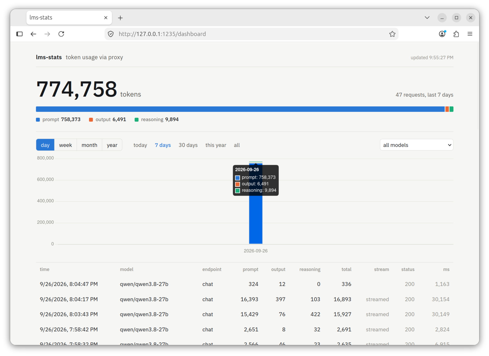

# lms-stats

A small proxy in front of one or more [LM Studio](https://lmstudio.ai)
instances that counts tokens per request and shows them on a dashboard. LM
Studio does not expose per-request usage anywhere; this does. With several
instances, requests are routed to whichever one has the requested model.

Single Rust binary, SQLite file, no auth. Meant for a trusted LAN.

## Run

    cargo run --release

Env vars (all optional):

| Var            | Default                     | Meaning                              |
|----------------|-----------------------------|--------------------------------------|
| `LMS_UPSTREAM` | `http://192.168.0.166:1234,http://192.168.0.163:1234` | LM Studio base URLs, comma-separated, plain `http://` (built without TLS) |
| `LMS_LISTEN`   | `0.0.0.0:1235`              | Proxy and dashboard bind address     |
| `LMS_DB`       | `./lms-stats.db`            | SQLite file, created if missing      |
| `LMS_BACKUP_DIR` | `~/Documents/lms-stats`   | Weekly snapshots of the database (see [Backups](#backups)); set to empty to disable |

Point your OpenAI-compatible clients at `http://<this-host>:1235/v1` instead of
LM Studio. Every path and method is forwarded unchanged, including auth
headers. Only these are counted:

- `POST /v1/chat/completions`
- `POST /v1/completions`
- `POST /v1/embeddings`

Dashboard: `http://<this-host>:1235/dashboard` (`/` redirects there).

## Several LM Studio instances

With more than one URL in `LMS_UPSTREAM`, every counted request first asks each
instance for `GET /v1/models` (2-second timeout, in parallel) and goes to the
first instance that lists the request's `model`. Nothing is cached, so a model
that was just downloaded or unloaded is picked up on the next request. If no
instance lists the model, or none answers, the request goes to the first URL
and LM Studio returns its own error. `GET /v1/models` through the proxy
returns the lists of all instances concatenated, so clients see every model.
Every other path goes to the first URL.

## Dashboard

- Total tokens for the selected range, split into prompt, output and
  reasoning. Output is `completion_tokens - reasoning_tokens`, because LM
  Studio folds reasoning into `completion_tokens`.
- Bucketed chart by day, week (Monday start), month or year, with presets for
  today, 7 days, 30 days, this year, all time. Filter by model.
- Per-request table, newest first, with "Load more" pagination. Rows with a
  status of 400 or above are shown in red. The `tok/s` column is generation
  speed: completion tokens over the time after the first streamed chunk
  arrived, which excludes prompt processing. Buffered (non-streamed) requests
  have no first-chunk time, so their figure is end-to-end and shown muted.
- Live: requests in flight show at the top of the table as a "generating"
  row with a running token estimate (one streamed chunk is roughly one token)
  and elapsed time, and the totals reload the moment a request finishes. The
  page listens on `/api/events`; a 15-second poll is the fallback.
- Chart.js and the IBM Plex Sans font load from CDNs; without internet the
  numbers and table still render, the chart does not.

Buckets use the proxy host's local timezone. Range presets use the browser's
timezone, so open the dashboard from a machine in the same timezone as the
proxy for the two to line up.

## JSON API

The dashboard is a static page over three endpoints you can use directly:

| Endpoint | Query params | Returns |
|---|---|---|
| `GET /api/requests` | `limit` (1–500, default 50), `offset`, `model` | Array of rows, newest first |
| `GET /api/aggregate` | `bucket` = `day` \| `week` \| `month` \| `year`, `from`, `to` (unix seconds), `model` | `{ totals, buckets }` |
| `GET /api/models` | | Array of model ids seen so far |
| `GET /api/active` | | `{ active: [...], completed }`: requests in flight (id, ts, endpoint, model, stream, chunks, elapsed_ms) and a count of rows written since start |
| `GET /api/events` | | Server-sent events; each event is the same snapshot, sent on every request start/finish and once a second |

Row fields: `id, ts, endpoint, model, prompt_tokens, completion_tokens,
reasoning_tokens, total_tokens, stream, status, duration_ms, ttft_ms` (`ttft_ms`
is null for buffered responses).

## What is stored

One row per counted request: timestamp, endpoint, model, prompt / completion /
reasoning / total tokens, stream flag, status, duration, time to first chunk. Never prompts,
responses, headers or client addresses.

The `status` column is the upstream HTTP status, except:

| Status | Meaning |
|---|---|
| `502` | LM Studio unreachable, or its stream failed mid-way. Counts are 0. |
| `499` | The client disconnected mid-stream. Counts are 0. |

LM Studio currently reports zero token usage for `/v1/embeddings`, so
embeddings rows show 0 tokens; the row is still recorded.

## Backups

The proxy copies the database to `LMS_BACKUP_DIR` (default
`Documents/lms-stats` in the home directory of the user running it) once a
week, as `lms-stats-YYYY-MM-DD.db`, and keeps the newest 5. It checks at
startup and then hourly: if the newest snapshot is 7 or more days old, or
there is none, it writes a new one with SQLite's `VACUUM INTO`, which gives a
consistent copy while requests are being recorded. Older snapshots beyond 5
are deleted; any other files in the directory are left alone. Failures are
logged and retried on the next hourly check.

Each snapshot is a complete database. To restore, stop the proxy and copy a
snapshot over the `LMS_DB` file.

## How streaming is counted

LM Studio only reports usage on a stream when `stream_options.include_usage`
is set. The proxy sets it, reads the final usage chunk, and drops that chunk
again unless the client asked for it itself, so older SDKs that index
`choices[0]` are unaffected.

## When LM Studio is down

The proxy stays up and answers with `502` and an OpenAI-style JSON error:

    {"error":{"message":"LM Studio at http://192.168.0.166:1234 is unavailable: ...","type":"upstream_unavailable"}}

Counted requests appear in the dashboard with status 502; other paths are
forwarded but not recorded.

## Run as a service

    cargo build --release
    sudo cp lms-stats.service /etc/systemd/system/
    sudo systemctl daemon-reload
    sudo systemctl enable --now lms-stats
    systemctl status lms-stats
    journalctl -u lms-stats -f

The unit runs the release binary from this checkout as user `shawon`, keeps
the database in `/var/lib/lms-stats/`, backs it up to
`/home/shawon/Documents/lms-stats/`, and restarts on crash. After
`cargo build --release` again, `sudo systemctl restart lms-stats` picks up
the new binary. Edit the `Environment=` lines in the unit to change upstream,
port or DB path.

### Windows service

On Windows, `install-service.ps1` registers the release binary as a native
service, the counterpart of the unit above. The binary itself speaks the
Windows service protocol when started with the `run-as-service` argument the
script passes:

    cargo build --release
    powershell -ExecutionPolicy Bypass -File install-service.ps1

The script asks for administrator rights once (UAC), starts the service at
boot, and restarts it on crash. Defaults, all overridable:

    powershell -ExecutionPolicy Bypass -File install-service.ps1 -Upstream "http://192.168.0.166:1234,http://192.168.0.163:1234" -Listen "0.0.0.0:1235" -DbPath "D:\data\lms-stats.db"

| Setting  | Default                                |
|----------|----------------------------------------|
| Upstream | `http://127.0.0.1:1234`                |
| Listen   | `0.0.0.0:1235`                         |
| Database | `C:\ProgramData\lms-stats\lms-stats.db`|
| Backups  | your `Documents\lms-stats` (`-BackupDir`, or `-NoBackup` to turn off) |
| Log      | `C:\ProgramData\lms-stats\service.log` |

The service runs as LocalSystem, which has no Documents folder of its own, so
the script resolves yours before asking for admin rights and stores it as
`LMS_BACKUP_DIR`. A service installed before backups existed takes none until
the script is run again.

The settings are stored per service in the registry (`Environment` value
under `HKLM\SYSTEM\CurrentControlSet\Services\lms-stats`), so the service does
not depend on any user profile. `sc.exe stop|start|query lms-stats` needs an
elevated shell; the dashboard does not. Remove with `uninstall-service.ps1`;
the database and log are kept.

### macOS LaunchAgent

On macOS, `install-service.sh` registers the release binary as a per-user
LaunchAgent, the counterpart of the unit above. It runs as you, starts at
login, and restarts on crash:

    cargo build --release
    ./install-service.sh

Settings are environment variables when running the script, all optional:

    LMS_LISTEN=0.0.0.0:1235 LMS_BACKUP_DIR= ./install-service.sh

| Setting  | Default                                                    |
|----------|------------------------------------------------------------|
| Upstream | `http://192.168.0.166:1234,http://192.168.0.163:1234`      |
| Listen   | `0.0.0.0:1235`                                             |
| Database | `~/Library/Application Support/lms-stats/lms-stats.db`     |
| Backups  | `~/Documents/lms-stats` (`LMS_BACKUP_DIR=` to turn off)    |
| Log      | `~/Library/Logs/lms-stats.log`                             |

The script writes `~/Library/LaunchAgents/com.shawonashraf.lms-stats.plist`
with absolute paths and the settings baked in, so the agent does not depend on
a shell profile. Running it again replaces a running agent, which is also how
to pick up a new binary after `cargo build --release`. Check or control it
with `launchctl print gui/$(id -u)/com.shawonashraf.lms-stats` and
`launchctl kickstart -k gui/$(id -u)/com.shawonashraf.lms-stats` (restart).
Remove with `./uninstall-service.sh`; the database and log are kept.

## GNOME Shell extension

`gnome-extension/lms-stats@shawonashraf/` adds a top-bar indicator: the
all-time token total next to a small monitor icon, and on click today / this
week / this month with request counts, plus an "Open dashboard" entry. It
polls the proxy at `http://127.0.0.1:1235` every 15 seconds (change the
`PROXY` constant at the top of `extension.js` if the proxy runs elsewhere).
GNOME Shell 48 to 50.

    ln -s "$PWD/gnome-extension/lms-stats@shawonashraf" ~/.local/share/gnome-shell/extensions/
    gnome-extensions enable lms-stats@shawonashraf   # or after the next login

On Wayland the Shell only picks up new extensions at login, so log out and
back in once. Errors, if any, show up in `journalctl --user -b /usr/bin/gnome-shell`.

## Development

    cargo test                    # unit tests plus an integration test against a mock LM Studio
    cargo clippy --all-targets

Layout: `src/proxy.rs` forwards and records, `src/usage.rs` extracts usage
from JSON and SSE streams, `src/db.rs` is the SQLite layer, `src/api.rs` the
JSON routes, `static/dashboard.html` the page (embedded at build time).
